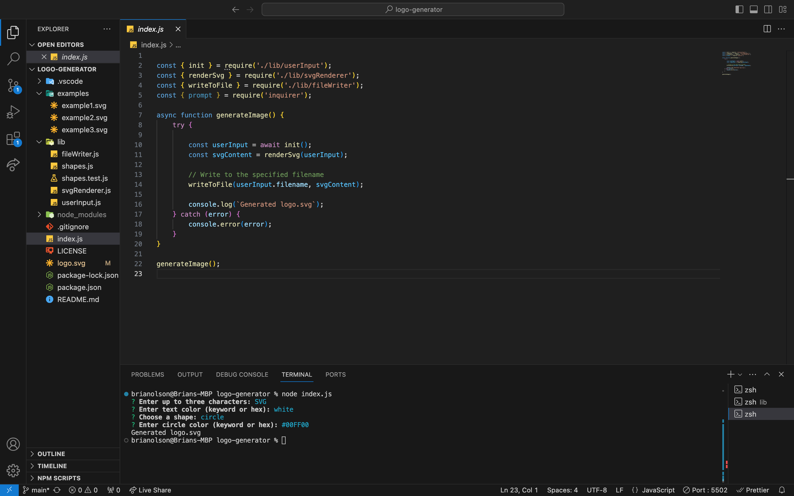

# logo-generator

## Description 
 The Logo Generator project is designed to make creating logo svg files easier. By using this program, users will just have to answer a few simple questions for what content they want in the design (no more than three letters) and what that design will look like (square, circle, or triangle).
 

## Table of Contents 
- [Installation](#Installation)
- [Usage](#Usage)
- [License](#License)
- [Contributing](#Contributing)
- [Tests](#Tests)
- [Questions](#Questions)

## Installation 
To install this project, please clone the repoository to your local machine and run 'npm install inquirer' to install the necessary dependencies. 

## Usage
To use this project, type in node index.js and answer the prompts that follow in the terminal. 

## License 
This project is licensed under the MIT License.

## Contributing 
N/A

## Tests
N/A

## Questions
GitHub Profile: [bwolson31](https://github.com/bwolson31)

For additional questions, contact me via email: bwolson31@gmail.com

